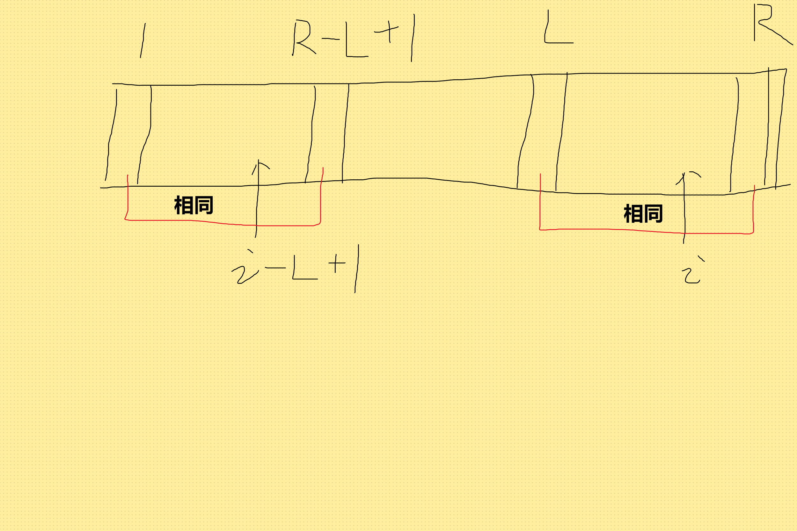

# LSF_project

## 大类

- 动态规划 （hqh cyz 

- 字符串（hqh cyz

- 数学（hqh hjl

- 数据结构（cyz hjl

- 图论（hqh hjl

- 计算几何（hjl cyz

- ~~杂项~~


数据结构 dp 数学 计算几何 图论 字符串 


## 动态规划

- [ ] DAG （cyz）
- [ ] 树形  （cyz）
- [ ] 插头 （hqh）
- [ ] 计数（hqh）
- [ ] 动态（hqh）
- [ ] 单调队列/栈 （cyz）
- [ ] 斜率 （cyz）
- [ ] 四边形 （cyz）
- [ ] 悬系法（cyz


## 字符串

- [x] 扩展kmp （hqh
- [ ] AC自动机（hqh
- [ ] 后缀数组（hqh
- [ ] 后缀自动机 & 广义~（hqh
- [ ] 序列自动机（hqh
- [ ] 马拉车（cyz
- [ ] 回文树（cyz


## 数学

- [ ] 二次剩余（hqh
- [ ] BSGS （hjl
- [ ] 原根（hjl
- [ ] 卢卡斯（hjl
- [ ] 莫比乌斯（hqh
- [ ] min25（hjl
- [ ] pollard-rho（hjl
- [ ] FFT（多项式） （hqh
- [ ] NTT（离散数论）（hqh
- [ ] FWT（异或）（hqh
- [ ] 拉格朗日差值（hqh
- [ ] 生成函数（hjl
- [ ] 线性基（hqh
- [ ] 置换群 & polya （hqh
- [ ] 博弈论 （hjl
- [ ] 01分数规划（hqh


## 数据结构


- [ ] 并查集 （hjl
- [ ] 分块（cyz
- [ ] 莫队（cyz
- [ ] Treap（hjl
- [ ] Splay（cyz
- [ ] 替罪羊树
- [ ] 可持久化线段树（hjl
- [ ] 可持久化trie树（hjl
- [ ] CDQ（hjl
- [ ] 整体二分（hjl
- [ ] 线段树套线段树（cyz
- [ ] kd树 （cyz
- [ ] 树剖（cyz
- [ ] LCT（cyz
- [ ] 扫描线（cyz


## 图论

- [ ] 二分图（hjl
- [ ] 网络流（hjl
- [x] tarjan（hqh
- [x] 2sat（hqh
- [ ] 差分约束（hjl

## 计算几何

- [ ] 凸包（cyz
- [ ] 旋转卡壳（cyz
- [ ] 半平面交（hjl
- [ ] 最近点对（cyz
- [ ] 三角剖分（hjl

## 安排……

___

|      | hqh        | cyz          | hjl          |
| ---- | ---------- | ------------ | ------------ |
| 1    | tarjan     | 分块         | 并查集       |
| 2    | 2sat       | 莫队         | BSGS         |
| 3    | 扩展kmp    | splay        | 博弈论       |
| 4    | ac自动机   | kd           | 原根         |
| 5    | FFT        | 树剖         | 卢卡斯       |
| 6    | NTT        | DAG          | CDQ          |
| 7    | 后缀数组   | 树形         | 二分图       |
| 8    | 后缀自动机 | 单调队列、栈 | 网络流       |
| 9    | 插头       | 斜率         | 差分约束 (2) |
| 10   | 计数       | 四边形       | min25        |


___

# 图论

## 有向图Tarjan

(BY hqh 20201004)

https://www.byvoid.com/zhs/blog/scc-tarjan/

**强连通分量**：有向图中的极大子图，满足该子图中任意两点可达

一个任意有向图由若干强连通分量构成，如果将一个任意有向图中的所有强连通分量**缩点**并建立新图，则可得到一张有向无环图。进而可执行类似拓扑排序、贪心、动态规划之类的操作

利用有向图的Tarjan算法可以找到所有强连通分量并进行缩点。具体算法执行流程可参考上面的链接或者《算法竞赛进阶指南》（下文简称蓝书）~~（或者等我有朝一日补写）~~

> **模板题**：
>
> [P3387 【模板】缩点](https://www.luogu.com.cn/problem/P3387)
>
> 题意：n个点m个边的任意有向图，点上有点权，求最长路径长度（重复点只计算一次
>
> 解法：执行缩点，得到有向无环图，然后在DAG上执行动态规划：
>
> ```c++
> f[y]=max(f[y],f[x]+sum[y]);
> ```

> [POJ1236 ？Network_of_Schools](http://poj.org/problem?id=1236)
>
> 题意：给一张学校网络表示某些学校能发软件给另一个学校（有向图），问最少要向多少学校提供软件方可使得所有学校都得到软件，以及至少添加多少个新的发软件的关系（新加有向边）能使得软件给任意一个学校都能使所有学校收到该软件
>
> 解法：缩点，得到有向无环图，显然一开始的0入度点数量就是答案
>
> 对于第二问，统计缩点后，0入度点和0出度点的数量（记为p和q），用类似下面的方法构造答案：让第1个0出度点链接第2个0入度点，让第2个0出度点链接第3个0入度点，……，让第q个0出度点链接第1个0入度点，使得整个图变成强连通图（当然上面写的是特殊情况，但构造思路大致是这样）。最后发现答案是max(p,q)

> BZOJ2330 银河/ [P3275 [SCOI2011\]糖果](https://www.luogu.com.cn/problem/P3275)
>
> 题意：给n个小朋友发糖，每人至少一块糖，给出k个小朋友的嫉妒关系（比如A糖的数量大于/大于等于/等于/小于/小于等于B得的糖数量），求最少得要多少糖才能满足这些关系。
>
> 解法：转化成差分约束的形式就是
> $$
> (d[A]=d[B])\Leftrightarrow(d[A]-d[B]\ge0) \&\& (d[B]-d[A]\ge0)\\
> (d[A]<d[B])\Leftrightarrow(d[B]-d[A]\ge1)\\
> (d[A]\ge d[B])\Leftrightarrow(d[A]-d[B]\ge0) \\
> (d[A]>d[B])\Leftrightarrow(d[A]-d[B]\ge1) \\
> (d[A]\le d[B])\Leftrightarrow(d[B]-d[A]\ge0) \\
> $$
> 按照差分约束的形式连接边（比如$d[B]-d[A]\ge1$就A向B连接1长度的边）在加上一个0号节点与所有节点连接长度为1的边，跑单原最长路即可（比如SPFA）
>
> 但是SPFA会被卡（其实luogu的数据能勉强卡过去），因此我们执行缩点，得到的强连通分量里面如果有正数长度的边就说明有正环，差分约束不能满足，无解。否则这个强连通分量内的所有小朋友得到的糖数量一样。这样就转换成有向无环图最长路问题了。（参考上面的模板题）

> [P1262 间谍网络](https://www.luogu.com.cn/problem/P1262)
>
> 题意：间谍的监视关系由有向图给出，你可以花钱收买某些间谍，被收买的间谍的点能走到的其他所有节点都能被控制。问最少要花多少钱才能控制所有间谍，或者输出无解。
>
> 解法：缩点，强连通分量内取能被收买的间谍中价格最低的那个作为新节点的价格。得到DAG，则显然价格为0入度点的总和。如果0入度点中有强连通分量不能被买就输出无解。

## 2-sat

（BY hqh 20201004）

基本问题：给出n个变量以及他们的逻辑关系（形如p是q的充分条件等），求是否会出现矛盾；如果不会有矛盾，给出构造所有变量赋值的方法。

对于第一问，利用类似扩展区域并查集的方法，给每个变量开个0,1两个点（$X_{i,0},X_{i,1}$），得到关系“若X则Y”，则$X_{1}$向$Y_{1}$连边，$Y_0$向着$X_0$连边（后者为逆否条件），诸如此类。最后看对于所有的变量是否有$X_{i,0}$ 和$X_{i,1}$在同一个强连通分量中，如果在就意味着矛盾。

实际实现的时候用1\~n表示x1到xn取值为0，n+1\~n*2表示取值为1。

> [POJ 3678 Katu Puzzle](http://poj.org/problem?id=3678)
>
> 题意：N个01变量，给出M个变量间的算式关系，形如 x and y = c / x or y = c / x xor y =c，求是否存在合法赋值使得算式全部成立
>
> 解法：以x_i and x_j =0 为例子，这意味着其中一个为1时，另一个变量必须为0，因此在(i+n,j), (j+n,a)之间连有向边。其他情况讨论也可得类似的连边关系（具体看代码）
>
> 最后跑tarjan，看是否存在i和i+n在同一个强连通分量中。

> [POJ 3683 Priest John's Busiest Day](http://poj.org/problem?id=3683)
>
> 题意：有n（1e3）对婚礼，持续时间为(S_i,T_i)，每个婚礼需要在开始或结束时举行仪式，仪式的持续时长为D_i，问是否能够让这些仪式的举行时间段不重叠，如果能，给出具体的仪式举行方案。
>
> 解法：穷举两个婚礼，如果一个婚礼（i）在开始时举行仪式会和另一个婚礼（j）在结束时举行仪式撞车，就说明这两种情况不能同时存在。用变量表示婚礼，变量赋值为0表示在婚礼开头举办仪式，1表示在结束时举办，则刚刚提到的情况可转化成为2sat问题，给(i,j),(j+n,i+n)连接有向边。其他情况类似。
>
> 用tarjan缩点，看是否存在i和i+n在同一个强连通分量中，有则说明矛盾。否则得到有向无环图，问题变成给整个强连通分量赋值。
>
> 同一个强连通分量中的变量赋值同时成立或者同时不成立（比如X\_{i,1}在2号强连通分量中，而2号强连通分量赋值为0，则说明X_i赋值为1不成立）。并且同一个变量的两个赋值所在的强连通分量必然不相同（否则就是上一段中说的矛盾情况），则给X\_{i,0}所在强连通分量赋值（比如0），另一变量X\_{i,1}所在强连通分量赋值必然与之相反（比如1）。
>
> 发现如果在0出度点做赋值不会对其他强连通分量赋值造成影响。因此在DAG的反图上作topo排序，给当前正在操作的节点赋值为0（如果已经有赋值就不再赋值），另一个对应的节点赋值为1，如此即可完成构造。

# 字符串

## 扩展kmp

(by hqh 20201018)

https://oi-wiki.org/string/z-func/

下文中字符串从1开始计数。

**LCP**：最长公共前缀

定义字符串a(长为m)关于模式串b的**extend数组**：extend[i]表示a的子串a[i~m]和b的LCP长度。如a='abcde'，b='bcd', 则a的extend[2]=3（最长公共前缀为bcd）

定义字符串b(长为n)的**z函数**：z[i]表示b[i~n]与b自身的LCP长度。如b='ababc'，z函数为[5 0 2 0 0]。z[1]实际上是无意义的，一般定义其为b的长度。

**求z函数的算法**：

核心思想是在采用暴力匹配的基础上，求z[i]前先初始化z[i]为之前某个已经求出的值，然后再暴力匹配。

假设现在求到某个位置i，记录之前能访问到的最右位置为r，对应访问到这个位置的下标为l。则b中，l\~r与1\~r-l+1对应子串相等。这意味着i开始处某一部分和1\~r-l+1是一样的，**见下图**。因此至少可以保证z[i]有z[i-l+1]那么多。当然也有可能z[i-l+1]作为i处的初始长度会超出目前已经知道的最右位置，因此应该限制其不能超过r（因为r的右边我们是不知道的，需要暴力匹配得知）。



初始化之后直接暴力匹配即可。可以证明此种做法复杂度是On的。（证明参见链接）

```c++
void get_z(int n=b_l)
{
    int l=1,r=1;
    z[1]=b_l; //undefined
    for(int i=2;i<=n;i++)
    {
        if(i<=r)
            z[i]=min(z[i-l+1],r-i+1);//init        
        while (i+z[i]<=n && b[z[i]+1]==b[i+z[i]]) //i+z[i] is next position, so accessible pos is i+z[i]-1
            z[i]++;
        if(i+z[i]-1>r)
            l=i,r=i+z[i]-1;
    }
}
```

**求extend的算法：**和z函数差不多

```c++
void exkmp(int m=a_l,int n=b_l) //get extend array
{
    while(extend[1]<=m && a[1+extend[1]]==b[1+extend[1]]) extend[1]++;
    int l=1,r=1;
    for(int i=2;i<=m;i++)
    {
        if(i<=r)
            extend[i]=min(z[i-l+1],r-i+1);
        while (i+extend[i]<=m && b[extend[i]+1]==a[i+extend[i]]) 
            extend[i]++;
        if(i+extend[i]-1>r)
            l=i,r=i+extend[i]-1;
    }
}
```

**模式匹配**：显然求出extend数组后，extend[i]=n处意味着匹配成功（从i开始的一段子串与b完全重合）。

**本质不同子串数目**：假设对于字符串a（长为n），后i+1字符构成的子串中本质不同子串数目已经求出（设为ans），现在我们来求后i个字符中本质不同子串数目。这个问题相当于在字符串头添加了一个字符c,使得a:=c+a。再用On的时间求出新字符串的z函数，然后遍历z[2\~n]，这之中最大的值z[j]即为新字符串的最长重合前缀，显然小于此长度的新字符串前缀也会重合，因此ans+=n-max(z[2\~n])

**字符串压缩**：（待补充）

> [P5410 【模板】扩展 KMP（Z 函数）](https://www.luogu.com.cn/problem/P5410)
>
> 模板题

> [P2375 [NOI2014\]动物园](https://www.luogu.com.cn/problem/P2375)
>
> 题意：求字符串a的num数组，num[i]表示子串a[1\~i]后缀与前缀相同且前后缀互不重叠的数目。如"abababa",num[7]=2，因为"a", "aba"为相同前后缀，但"ababa"不是，因为重叠了。
>
> 解法：考虑到a的z函数的意义为i开始的子串与自身的LCP长度，那么对于更短的长度（设此时终点为j），a[i\~j]也是a的前缀。比如a="bbbbb",z[3]=3，也即a[1\~3]与a[3\~5]相同，那么a[1\~2]与a[3\~4], a[1]与a[3]也相同。
>
> 因此假如没有不能重叠的限制，那么对于位置i，其z[i]会对i\~i+z[i]-1处的num都有1的贡献。考虑上不能重叠的限制，因为z[i]可能很大而导致公共前缀重叠，因此对于z[i]>=i的部分的贡献不予考虑即可。也即z[i]对i\~min(i+z[i]-1,i+(i-1)-1)的numm有贡献。
>
> 最后差分一下再累加差分贡献即可。（当然这题你也可以用一般kmp做）

>### [CF1051E Vasya and Big Integers](https://www.luogu.com.cn/problem/CF1051E)
>
>题意：给三个大数a,L,R, 求将a划分成每段构成的数无前导零且大小介于[L,R]之间的方案数（Mod 998244353）
>
>$1\le a\le 1e(1e6), 0\le L\le R\le 1e(1e6)$，也即上限有十万位。
>
>解法：设$dp[j]$表示以j\~j+1之间作为一段的边界，划分的方案数。则
>$$
>dp[j]=\sum(dp[i])
>$$
>其中i为同时满足下面3个条件的所有正整数：
>
>1. $0\le i \le j-1$
>2. $a[i+1]\neq 0$ （除非L仅有一位，参见下文讨论）
>3. $a[i+1 \text{~} j]$构成的数在[L,R]之内
>
>条件2是为了限制有前导零的划分不能被转移。只有一种情况下这段能以0开头，就是这段构成的数本身就是0。这种情况下L=0，因此i=j-1这种情况的划分需要做特判。
>
>除此之外，易发现满足条件的i是连续的。设a[i+1\~j]构成的数位M，|M|为一个数的数位长度，则显然|L|<|M|<|R|的情况都满足条件3，唯独取等号处需要比较L或者R与M的大小方能确定对应位置的i是否满足条件3。而数的比较可通过比较两数的LCP后一位解决。求出L、R的z函数，再求出a关于L、R的extend数组即可。当然最后要保证i满足条件1.
>
>连续的一段i的转移可通过保存dp的前缀和dpsum实现，但当a[j+1]=0时,其不应该被计入dpsum中，以免破坏条件2.
>
>具体实现参见代码。


## AC自动机

（By hqh 20201031）

https://oi-wiki.org/string/ac-automaton/

自动机是一种有向图，图上的结点表示处于某种状态，而边表示状态的转移。

AC自动机的主要用途是“多模式匹配”，也即给定若干个模式串，再给定一个主串，要求出每个模式串在主串中的出现次数。

主要的思想是将多个模式串构建trie树，然后通过修改trie树的一些边，来实现多模式快速匹配。因此你可以理解为在trie树上跑kmp。

对AC自动机而言，每个结点的状态表示当前多模式匹配的进度（在匹配结束处，对应结点拥有一个匹配完成标识符end[u]表示成功匹配一个模式串）；边是字符，引导转移到下一个状态。

 ### fail指针

构建自动机的关键在于fail指针。构建完成trie树后，我们利用bfs构建fail指针。

fail指针代表的意义是指向trie树中的另一个结点，这个结点满足从根走到对应结点所对应的字符串，是当前结点对应的字符串的**最长后缀**。比如当前结点对应字符串是abaaa，trie树上还有另一条路径表示aaa，则其fail指向此结点。

当我们匹配过程中失配时（走到某一个结点后，trie树上对应下一个字符的结点不存在），那么我们就跳到fail，再继续尝试匹配。这相当于抛弃一部分当前模式串前缀使得匹配能够继续进行。

具体构建方式是用bfs，取出队头结点u，然后遍历此节点的接下来的所有可能字符i（0\~25），按照如下代码递推地更新下一个结点的fail指针：

```
fail[trie[u][i]]=trie[fail[u]][i];
```

也即让下一个结点的fail指针，指向当前结点fail指针的下一个字符i对应的结点。因为是用bfs，可以保证下一个结点更浅的结点已经被更新，所以可以这么做。

其他详细信息请参见文头所给链接。

### 字典图

使用fail指针在失配时跳跃很蛋疼，因为如果跳了之后还是失配那么你还是得继续从fail[u]继续跳到fail[fail[u]]，那么有没有更好的方法呢？

注意到如果在u处前往i字符时失配，那么trie\[u\]\[i\] 必然未定义，我们通过改写trie\[u\]\[i\] 使得其直接指向下一个不失配的fail即可。

比如：

```
。。。
（前面是BFS取出队头u结点）

for(int i=0;i<26;i++)
        {
            if(trie[u][i])
            {
                fail[trie[u][i]]=trie[fail[u]][i];
                q.push(trie[u][i]);
            }
            else
            {
                trie[u][i]=trie[fail[u]][i];
            }
        }
。。。
```

使用`trie[u][i]=trie[fail[u]][i];` 在求fail的同时改写未定义trie指针即可。这样，在匹配时可以直接令`u=trie[u][i]`（不论是否失配）。

这样之后trie其实已经不再是一棵树，而是一个会自指的图，我们称之为字典图。

### last优化

事实上，求每个模式串在主串中的出现次数，不仅需要在字典图上遍历，而且每遍历一个结点还得跳fail（不论失配与否），因为你并不知道当前匹配位置有多少个模式串能匹配。

比如：主串abaaa，模式串aaa、baaa；匹配到主串的最后一个a时，会在trie图上的baaa处，但还是得跳fail，跳到trie图上的aaa上，才能知道这个字符串也在主串最后一个a处成功匹配。

这个做法带来的代价其实可以换成另一种做法以彻底改善（见下文fail树），但这里先说明另一种优化方法。

在跳fail的过程中，并不是每一个结点都是某一模式串的终点。而在字典图构建完毕后，fail树其实对匹配而言意义就不大了，因此我们希望fail能直接跳到“某个模式串”的结尾。我们引入last数组，其可以直接跳到“某个模式串”的结尾。

我们在构建fail指针时添加这么一句话：

```
...
                fail[trie[u][i]]=trie[fail[u]][i];
                last[trie[u][i]]=(id[fail[trie[u][i]]]==0)?(last[fail[trie[u][i]]]):(fail[trie[u][i]]); //有效字符串结尾
                q.push(trie[u][i]);

...
```

id[u] 表示结点u作为某一模式串的结尾，对应的字符串编号（如果u不是某一串的结尾节点，那么其为0）。通过last的递推即可求得last数组。在匹配求解每个模式串在主串中的出现次数的过程中，改跳last而非fail即可。

但这么做的优化仅仅只是常数上的，如果给若干个模式串a、aa、aaa、aaaa……，那还是会被卡，因此我们引入fail树。

### fail树

将所有结点的fail指针反过来接，将构成一个以trie图0结点为根的树，成为fail树。从fail树向下走，相当于在当前字符串前添加前缀。比如abb，从fail树向下走到fuabb（当然可能会有好几个孩子，这里只是举个例子）。

构建此树也很简单，在fail指针构建完成后：

```
    for(int i=1;i<=total;i++)
    {
        adde(fail[i],i);
    }
```

回到上面的问题，之前我们通过last数组进行了优化。现在利用fail树，我们可以利用树上差分的方法，指在当前结点u处添加一个标记1，表示自u到根的路径都会受此标记影响。匹配结束之后对fail树做dfs以求出差分的相加值，最后看每一个结点的值，此值就是对应的字符串的出现次数。

当然fail树还有很多用途，除了差分之外，还可以对其dfn+线段树、树状数组、树链剖分……嗯。


> [P3808 【模板】AC自动机（简单版）](https://www.luogu.com.cn/problem/P3808)
>
> 板子题，只用求出出现的模式串而不需要统计个数，直接跳fail指针完成匹配。
>
> [P3796 【模板】AC自动机（加强版）](https://www.luogu.com.cn/problem/P3796)
>
> 同样是板子题，求出出现的模式串的次数，改用last指针跳跃即可。
>
> [P5357 【模板】AC自动机（二次加强版）](https://www.luogu.com.cn/problem/P5357)
>
> 题意和加强版相同，但需要用fail树+差分才能过（规避掉匹配时跳任何指针），具体做法上文已有描述
>
> [Educational Codeforces Round 97 (Rated for Div. 2)](https://codeforces.com/contest/1437)[G：Death DBMS](https://codeforces.com/contest/1437/problem/G)
>
> 题意：给一堆模式串（可能本质相同，但他们的编号不同），每个编号对应的字符串初始权值为0，然后给出两种操作：第一种操作给出一个字符串，求出其中出现的模式串的最大权值；第二种操作给出两个数x y，要将第x个模式串的权值改为y
>
> 解法：注意此题中，两个本质相同的字符串可能会有不同的权值。
>
> 使用ac自动机构建字典图，那么“两个本质相同的字符串可能会有不同的权值”就相当于在字典图的结点上维护多个权值（修改和查询最大值）。
>
> 可以在每个结点上开个动态开点的线段树。但为了实现方便，这里使用N个（N为字典图中结点个数）multiset来维护每个结点上的多个权值。
>
> 剩下的就简单了。对于操作一，用ac自动机匹配，每走到一个结点跳last（这题的数据跳fail会t），然后求对应结点multiset中值的最大值。对于操作2，在字典图上找到对应串后修改对应multiset（删除旧的权值并插入新权值）即可

## 后缀数组

**后缀数组SA**：字符串各个后缀的排名到下标的映射。如aabab，按字典序从小到大排，后缀分别为aabab、ab、abab、b、bab，sa\[1\~5 \] =1 4 2 5 3

**排名数组RK**：从某一位置i开始到字符串末尾所构成的后缀，在所有后缀中的排名。相当于SA的逆映射。

**求法**：倍增法。每次考虑长度w为1、2、4、8……（到小于等于n的最大2的幂次为止）的子串，对于某个位置i，用其位置i的sa对应值作为第一关键字，位置为i+w的sa对应值作为第二关键字（如果i+w大于n就看成无穷小），进行排序。由于只有两个关键字，因此排序使用线性排序法 （比如计数排序或者基数排序，下文中主要采用计数排序，因其复杂度只和值域有关），可将求SA的整体时间复杂度下降至O（nlogn）。具体参见代码。

另一种求法是用后缀自动机。参见“后缀自动机”一节。

### Height 数组

含义：第i名和第i-1名(注意是排名)的最长公共前缀长度

```
height[i]=lcp(sa[i],sa[i-1])
```

引理：第i个位置的后缀对应的height值，大于等于上一个位置（i-1）的height值-1

```
height[rk[i]]>=height[rk[i-1]]-1
```

求解：借助上面的引理可在On时间内求出height数组。

```c++
for (i = 1, k = 0; i <= n; ++i) {
  if (k) --k;
  while (s[i + k] == s[sa[rk[i] - 1] + k]) ++k;
  ht[rk[i]] = k;  // height太长了缩写为ht
}
```


## 后缀自动机（Suffix Automator，SAM）

后缀自动机是能够匹配某个字符串S的所有后缀的自动机。就是说取S的任何一个后缀（包括S自身），在SAM中从开始节点t0走，肯定都能走到某一个终止状态。

符合这个性质的图是有向无环图，并且有很多图都符合上面的要求。但SAM是其中节点数量最少的一个（**极小性**）。

### endpos等价类、SAM中的节点意义

字符串S=abcbc。考虑子串bc在S的终止位置（endpos集合），为3、5。子串c在S中的终止位置也为3、5。像这样终止位置集合完全相同的S的子串称为endpos等价类。

在SAM中，**SAM的一个节点就代表一个endpos等价类**。因此如果有一个节点代表子串bc，则这个节点也代表子串c，反之亦然。

### 节点的最长串、节点的len

显然一个等价类中可能包含多个S的子串，我们取其中最长的一个，作为这个等价类对应节点v的最长串，并记len（v）为这个最长串的长度。

### 节点的link（father）

节点的最长串的前几个（按照长度递减来数）后缀都会在这个节点所在等价类中。但可能从之后某个位置开始的后缀就都不在这个等价类中了。我们记不在当前节点等价类中最长的串为B，则B对应另一个等价类u（如果B不存在，就令u为SAM的起始节点）。我们令link（v）=u，称为**后缀链接**。

所有SAM中的节点（除了起始节点）都有后缀连接。这些后缀连接构成一颗（有向）树，从叶子指到树根。称之为**后缀链接树**。

### 后缀链接树、终点节点


左图是字符串S=abcbc的后缀自动机（SAM），右图为其后缀链接树。

字符串S的所有前缀在自动机中也对应着不同的节点。从初始状态t0开始按照字符串S走，所经过的节点被称为**终点节点**。如右图中的a、ab、abc、abcb、abcbc。（注意和终止状态区分）

定义每个节点的**终点集合**：每个节点的终点集合等于其 **子树** 内所有终点节点对应的终点的集合。比如b节点的子树中有ab、abcb节点，b的终点集合就是ab、abcb节点。

- 如果节点 A 是 B 的祖先，则节点 A 对应的字符串是节点 B 对应的字符串的 **后缀** 。
- S的前缀子串s1(1,p) s2(1,q)对应的最长公共后缀，是两串对应节点u、v的LCA对应字符串。
- 节点len的大小随着深度递增而不下降。
- 后缀链接树中的非叶子节点对应的最长串，这个最长串相当于从其终点集合中的任意一个终点的下标往前取这个非叶子节点的len个长度（包含这个开始取的位置）的字符组成。

- 后缀链接树中的叶子节点就是终点节点。但反过来不一定成立（如S=ababa，aba是前缀，但aba出现了两次，有更长的ababa作为其儿子）。这是由于其他出现只有一次的非前缀串都被包含在某一只出现一次的前缀串中了。换句话说如果bab只出现了一次，那么（从头到）...bab也肯定只出现一次。
- 设所有终点节点的siz为1。从叶子节点开始bfs，累加siz，非叶子节点的siz值就是这个节点的终点集合大小，也即这个节点对应最长串出现的次数。（后面模板题会用到）

### 构建方法

步骤有点麻烦（其实还好），参见https://oi-wiki.org/string/sam/

- 状态数不会超过2n-1
- 转移数不会超过3n-4
- 构建的时间复杂度为线性级别

### 应用

1. 给定的字符串P是否在S中出现：
   直接从起点走，中途遇到某个字母走不下去了就说明没出现
2. 不同子串个数：
   有向无环图动态规划。或者用len（i）-len（link（i））对每个结点求和。（这个式子是相当于这个状态对整个串S的不重复子串贡献）
3. 求所有不同子串总长度

# 数据结构

## 并查集

(by hjl 2020104)

 https://blog.csdn.net/niushuai666/article/details/6662911 （并查集的一些blog的合集）

并查集主要用于解决一些元素分组的问题。它管理一系列不相交的集合，并支持两种操作： 

-  **合并**（Union）：把两个不相交的集合合并为一个集合。 

-  **查询**（Find）：查询两个元素是否在同一个集合中。

  

  ​	通俗地讲一个故事：几个家族进行宴会，但是家族普遍长寿，所以人数众多。由于长时间的分离以及年龄的增长，这些人逐渐忘掉了自己的亲人，只记得自己的爸爸是谁了，而最长者（称为「祖先」）的父亲已经去世，他只知道自己是祖先。为了确定自己是哪个家族，他们想出了一个办法，只要问自己的爸爸是不是祖先，一层一层的向上问，直到问到祖先。如果要判断两人是否在同一家族，只要看两人的祖先是不是同一人就可以了。

在这样的思想下，并查集的查找算法诞生了。

**洛谷里的一道亲戚问题（P1551）**

 https://www.luogu.com.cn/problem/P1551 

>  **题目背景**
>  若某个家族人员过于庞大，要判断两个是否是亲戚，确实还很不容易，现在给出某个亲戚关系图，求任意给出的两个人是否具有亲戚关系。
>  **题目描述**
>  规定：x和y是亲戚，y和z是亲戚，那么x和z也是亲戚。如果x,y是亲戚，那么x的亲戚都是y的亲戚，y的亲戚也都是x的亲戚。
>  **输入格式**
>  第一行：三个整数n,m,p，（n<=5000,m<=5000,p<=5000），分别表示有n个人，m个亲戚关系，询问p对亲戚关系。
>  以下m行：每行两个数Mi，Mj，1<=Mi，Mj<=N，表示Mi和Mj具有亲戚关系。
>  接下来p行：每行两个数Pi，Pj，询问Pi和Pj是否具有亲戚关系。
>  **输出格式**
>  P行，每行一个’Yes’或’No’。表示第i个询问的答案为“具有”或“不具有”亲戚关系。 
>
>  

​	 这其实是一个很有现实意义的问题。我们可以建立模型，把所有人划分到若干个不相交的集合中，每个集合里的人彼此是亲戚。为了判断两个人是否为亲戚，只需看它们是否属于同一个集合即可。因此，这里就可以考虑用并查集进行维护了。 


**并查集的引入**

​	并查集的重要思想在于，**用集合中的一个元素代表集合**。我曾看过一个有趣的比喻，把集合比喻成**帮派**，而代表元素则是**帮主**。接下来我们利用这个比喻，看看并查集是如何运作的。


​	最开始，所有大侠各自为战。他们各自的帮主自然就是自己。*（对于只有一个元素的集合，代表元素自然是唯一的那个元素）*

​	现在1号和3号比武，假设1号赢了（这里具体谁赢暂时不重要），那么3号就认1号作帮主*（合并1号和3号所在的集合，1号为代表元素）*。


 	现在2号想和3号比武*（合并3号和2号所在的集合）*，但3号表示，别跟我打，让我帮主来收拾你*（合并代表元素）*。不妨设这次又是1号赢了，那么2号也认1号做帮主。 


 	现在我们假设4、5、6号也进行了一番帮派合并，江湖局势变成下面这样： 


​	现在假设2号想与6号比，跟刚刚说的一样，喊帮主1号和4号出来打一架（帮主真辛苦啊）。1号胜利后，4号认1号为帮主，当然他的手下也都是跟着投降了。


​	好了，比喻结束了。如果你有一点图论基础，相信你已经觉察到，这是一个**树**状的结构，要寻找集合的代表元素，只需要一层一层往上访问**父节点**（图中箭头所指的圆），直达树的**根节点**（图中橙色的圆）即可。根节点的父节点是它自己。我们可以直接把它画成一棵树：


#### **并查集的基本操作**

（以上面的帮派为例）

1. **初始化**

   ```c++
   int fa[Max]; //用于储存每个人的所在帮派的上一级是谁
   inline void Init(int n)
   {
   	for(int i=1;i<=n;i++)
   		fa[i]=i;  //刚开始的时候每个人的所在的帮派的帮主都是他自己
   }
   ```

   

2. **查询**

   ```c++
   int find_father(int x) //用于寻找自己帮派的帮主
   {
       if(fa[x]==x)  //如果帮派的帮主是自己的话，直接返回帮主是自己
           return x;  
       else 
           return find_father(fa[x]); 
       					//如果不是的话，那就寻找自己的上一级，直到找到帮主为止
   }
   ```

   

3. **合并**

   ```c++
   inline void _union(int x,int y)
   {
   	int fa_x=find_father(x); //找到x和y的帮主
       int fa_y=find_father(y);
       if(fa_x!=fa_y)   //如果不是同一个人的话，就合并
       	fa[fa_x]=fa_y;
   }
   ```

   **PS**：上面的查询和合并都只是初始版本


### **进阶版本**

#### **路径压缩**

​	用于合并的时候直接合并，导致最简单的并查集效率是比较低的。例如，来看下面这个场景：


现在我们要union(2,3)，于是从2找到1，fa[1]=3，于是变成了这样：


​	要是再多来几次这种操作，那么这条链就会特别的长，在这种情况下，进行查询操作的话效率就会特别的低，于是有了**路径压缩**。

​	我们最理想的情况下，就是所有帮派的成员的上一级就是帮主，就是查找一次就能找到他属于那个帮派。 其实这说来也很好实现。只要我们在查询的过程中，**把沿途的每个节点的父节点都设为根节点**即可。下一次再查询时，我们就可以省很多事。这用递归的写法很容易实现： 

```c++
int find_father(int x)
{
    if(fa[x]==x)
        return x;
    else {
        fa[x]=find_father(fa[x]);
        return fa[x];
    }
}

/*极简版本*/
int find_father(int x)
{
    return (fa[x]==x)?x:(fa[x]=find_father);
}
```


#### 启发式合并（按秩合并）

​      帮派合并的时候，我们都是直接合并的，没有考虑其他的因素，所以当两个帮派合并的时候，可能是大的帮派（人数很多）合并到小的帮派（人数少）中，这样会造成一些麻烦。下面的是oi-wiki里的分析：

> 由于需要我们支持的只有集合的合并、查询操作，当我们需要将两个集合合二为一时，无论将哪一个集合连接到另一个集合的下面，都能得到正确的结果。但不同的连接方法存在时间复杂度的差异。具体来说，如果我们将一棵点数与深度都较小的集合树连接到一棵更大的集合树下，显然相比于另一种连接方案，接下来执行查找操作的用时更小（也会带来更优的最坏时间复杂度）。
>
> 当然，我们不总能遇到恰好如上所述的集合————点数与深度都更小。鉴于点数与深度这两个特征都很容易维护，我们常常从中择一，作为估价函数。而无论选择哪一个，时间复杂度都为 O(ma(m,n))，具体的证明可参见 References 中引用的论文。
>
> 在算法竞赛的实际代码中，即便不使用启发式合并，代码也往往能够在规定时间内完成任务。在 Tarjan 的论文[1]中，证明了不使用启发式合并、只使用路径压缩的最坏时间复杂度是 O(mlogn)。在姚期智的论文[2]中，证明了不使用启发式合并、只使用路径压缩，在平均情况下，时间复杂度依然是  O(ma(m,n))。
>
> 如果只使用启发式合并，而不使用路径压缩，时间复杂度为O(mlogn) 。由于路径压缩单次合并可能造成大量修改，有时路径压缩并不适合使用。例如，在可持久化并查集、线段树分治 + 并查集中，一般使用只启发式合并的并查集。

   

#### 法一：

​				**以树的深度为参考进行合并**

  我们用一个数组rank[]记录每个根节点对应的树的深度（如果不是根节点，其rank相当于以它作为根节点的**子树**的深度）。一开始，把所有元素的rank（**秩**）设为1。合并时比较两个根节点，把rank较小者往较大者上合并。路径压缩和按秩合并如果一起使用，时间复杂度接近 ![[公式]](https://www.zhihu.com/equation?tex=O%28n%29) ，但是很可能会破坏rank的准确性。

**初始化**

```c++
int fa[Max]; //用于储存每个人的所在帮派的上一级是谁
int ran[Max]; //用于储存帮派下面的级数（树的层数）
inline void Init(int n)
{
	for(int i=1;i<=n;i++)
		fa[i]=i,ran[i]=1;  //刚开始的时候每个人的所在的帮派的帮主都是他自己
}
```

 **合并**

```c++
inline void _union(int i,int j)
{
	int x=find_father(i); //找到x和y的帮主
    int y=find_father(j);
    if(ran[x]>ran[y])    //x的层数大于y的，那么直接挂到x上，层数不变
        fa[y]=x;
    else if(ran[x]<ran[y])//x的层数小于y的，那么直接挂到y上，层数不变
        fa[x]=y;
    else if(x!=y){     //如果深度相同且根节点不同，则新的根节点的深度+1
        fa[x]=y;
        ran[y]++;
    }
}
```

#### 法二：

​				**以树的规模为参考进行合并（就是节点的个数，即帮派的人数）**

**初始化**

```c++
int fa[Max]; //用于储存每个人的所在帮派的上一级是谁
int size[Max]; //用于储存帮派下面的人数
inline void Init(int n)
{
	for(int i=1;i<=n;i++)
		fa[i]=i,size[i]=1;  //刚开始的时候每个人的所在的帮派的帮主都是他自己，帮派人数为1
}
```

 **合并**

```c++
inline void _union(int i,int j)
{
	int x=find_father(i); //找到x和y的帮主
    int y=find_father(j);
    if(ran[x]<ran[y])    //让x的规模始终大于y
		swap(x,y);
    fa[y]=x; //合并
    size[x]+=size[y];   //x的规模要加上y的规模
}
```


#### 例题

开头的洛谷的**P1551 亲戚问题**

 https://www.luogu.com.cn/problem/P1551 

>  **题目背景**
>  若某个家族人员过于庞大，要判断两个是否是亲戚，确实还很不容易，现在给出某个亲戚关系图，求任意给出的两个人是否具有亲戚关系。
>  **题目描述**
>  规定：x和y是亲戚，y和z是亲戚，那么x和z也是亲戚。如果x,y是亲戚，那么x的亲戚都是y的亲戚，y的亲戚也都是x的亲戚。
>  **输入格式**
>  第一行：三个整数n,m,p，（n<=5000,m<=5000,p<=5000），分别表示有n个人，m个亲戚关系，询问p对亲戚关系。
>  以下m行：每行两个数Mi，Mj，1<=Mi，Mj<=N，表示Mi和Mj具有亲戚关系。
>  接下来p行：每行两个数Pi，Pj，询问Pi和Pj是否具有亲戚关系。
>  **输出格式**
>  P行，每行一个’Yes’或’No’。表示第i个询问的答案为“具有”或“不具有”亲戚关系。 

裸的并查集

